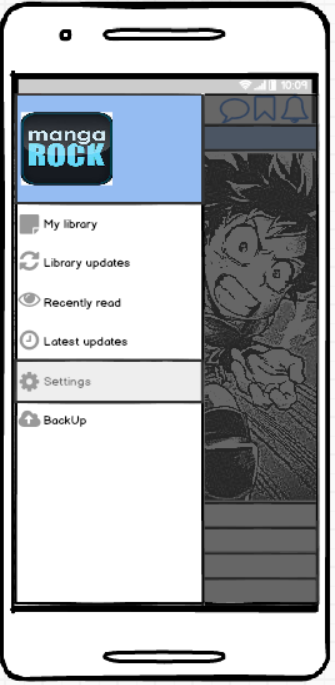
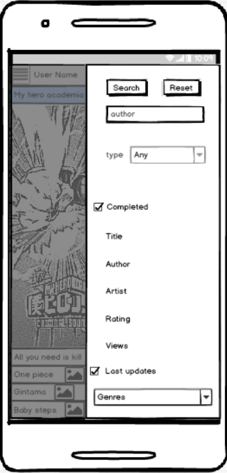
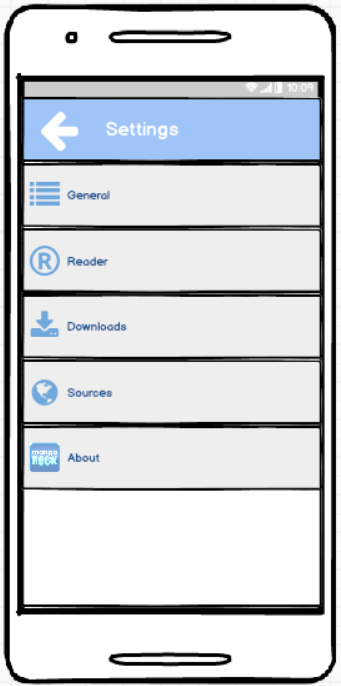

1 Introduction       
Manga Reader - Read Manga Free is an application read manga online & offline. Update new chapter manga every day and easy to use.
Features:    
- 4 reading direction: Left to right, scroll vertical, right to left, Vertical.   
- Search with author, key word, type, genres.    
- Unlimited download to read offline.    
- Backup & restore all your manga for multi-device usage.      
2 User Requirements    
2.1 Software Interfaces    
Java Fx will be used to create projects GUI.    
MySql will be used to save downloaded manga chapters.      
2.2 User Interfaces      
At the initial stage, the GUI will consist of 6 stages.   
2.2.1 Main stage. On this stage the user can open manga, he wants to start reading or add selected manga to his list of preferences.   Check the preview image. Also the user can go to the list of preferences, and other stages.   
    
2.2.2 Reading stage. There is 4 reading direction: Left to right, scroll vertical, right to left, Vertical.   
    
2.2.3Menu stage.   
       
2.2.4 Searching stage. Search with author, key word, type, genres.    
     
2.2.5 Settings stage.          
      
2.2.6 Manga preview. The user can chose the manga chapter he wants to read continue reading from the last read chapter. Also he can rate selected manga series and open the text of manga description.      
    
2.3 User Characteristics    
This application is designed for a wide range of users and has no age limit. It is assumed that this product will be used by people who are interested in reading manga, manhwa, manhua.  
Minimum necessary skills - the ability to use a mobile phone at a basic level and experience with software products.
2.4 Assumptions and Dependencies   
If this app will be famous among the non English speaking people, we should localize it.   
3 System Requirements   
To run this application, you need a smartphone based on Android 4.5 or later.   
3.1 Functional Requirements   
In manga reader the following possibilities should be realized:   
1.	To scroll the manga image in 4 directions;   
2.	To open the next/previous page by tipping on the left/right side of the image;   
3.	To rank/unrunk current manga;    
4.	To check/unckech favorite manga updates;     
5.	To crud manga source.
6. To read manga
7. To create accoutnt and log on/out

3.2 Non-Functional Requirements
3.2.1 SOFTWARE QUALITY ATTRIBUTES
It is expected that the product will be compatible with any mobile device based on Android 4.5 or later. Taking into account that the product is a manga reading application and the human lives and health of people do not depend on the correctness of its work, there are no requirements for its reliability. However, for successful monetization in the future (after the formation of demand) there is a need for trouble-free operation

